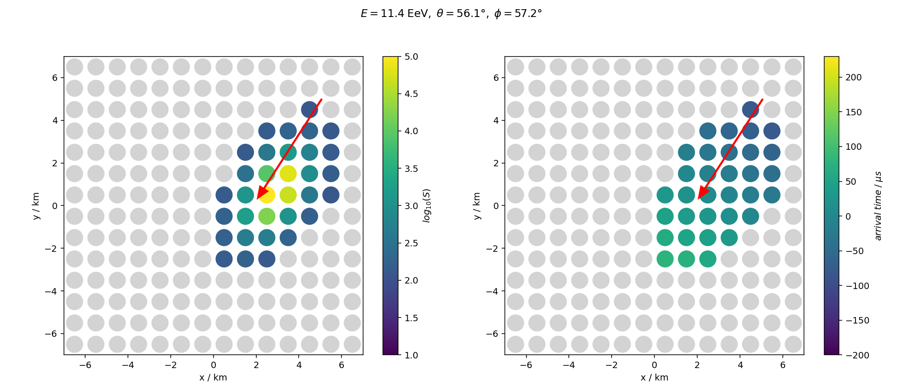

# Air shower reconstruction using deep neural networks
Train neural networks to reconstruct air-shower properties using detector responses measured at a hypothetic cosmic-ray observatory located at a high of 1400 m. The observatory features a cartesian array of 14 x 14 particle detectors with a distance of 750 m.

Each particle detector measures two quantities that are stored in the form of a cartesian image (2D array with 14 x 14 pixels).
We will use these images to train neural networks to reconstruct the energy of the events.

## Tutorial
We will use [jupyter](https://jupyter.org/) notebooks in the tutorial. As deep learning framework [Keras](https://keras.io/) is used.

For training the DNNs, we use Google cola to accelerate the training using a GPU. For opening the jupyter in colab, just click on the respective badge.

You can access the slides for the tutorial at:

Find more examples for deep learning in physics at www.deeplearningphysics.org/.

## Fully-connected network
Train a **fully-connected network** to reconstruct the energy of a cosmic-ray-induced air shower.  

## Convolutional neural network
Train a **convolutional neural network** to reconstruct the energy of a cosmic-ray-induced air shower.  

