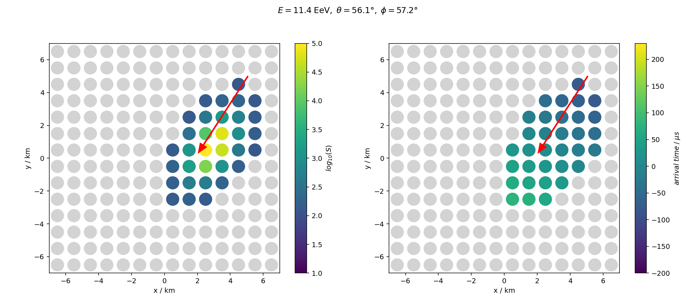

# Air shower reconstruction using deep neural networks
Train neural networks to reconstruct air-shower properties using detector response measured at a hypothetic cosmic-ray observatory located at a high of 1400 m. The observatory features a cartesian array of 14 x 14 particle detectors with a distance of 750 m.

Each particle detector measures two quantities that are stored in the form of a cartesian image (2D array with 14 x 14 pixels).
We will use these images to train neural networks to reconstruct the energy of the events.

